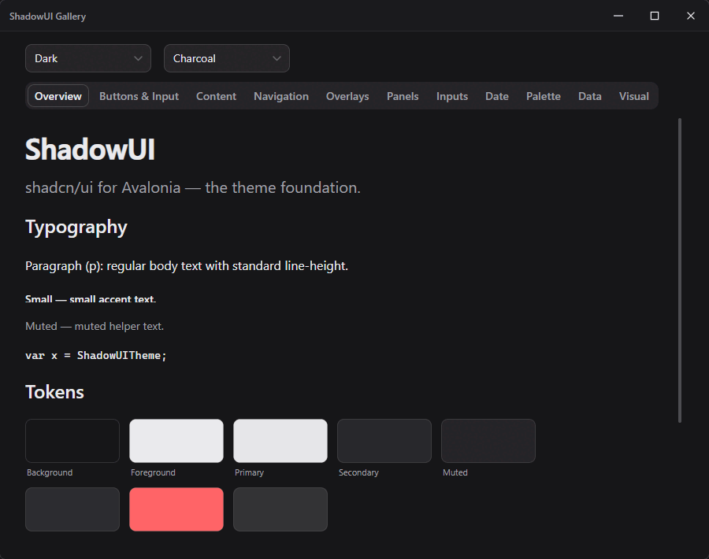

# ShadowUI

A port of [shadcn/ui](https://ui.shadcn.com) for [Avalonia UI](https://avaloniaui.net) 12 / .NET.
50+ components · Light/Dark theme · 13 color palettes · Custom title bar · Native AOT compatible.

<p align="center">
  
</p>

## Requirements

- .NET 8 or .NET 10
- Avalonia 12+

## Installation

```bash
dotnet add package ShadowUI
```

```xml
<PackageReference Include="ShadowUI" Version="1.0.4" />
```

## Getting Started

**1. Add the theme to your `App.axaml`:**

```xml
<Application xmlns="https://github.com/avaloniaui"
             xmlns:shadui="using:ShadowUI"
             RequestedThemeVariant="Dark">
  <Application.Styles>
    <!-- Charcoal (recommended default); any of the 13 palettes: Zinc, Slate, Blue, Violet, ... -->
    <shadui:ShadowUITheme BaseColor="Charcoal" />
  </Application.Styles>
</Application>
```

**2. Add the namespace to your views:**

```xml
<Window xmlns:shadui="using:ShadowUI" ...>
```

**3. Use components:**

```xml
<shadui:Card>
  <StackPanel Spacing="8">
    <shadui:CardTitle Content="Welcome" />
    <shadui:CardDescription Content="Get started with ShadowUI." />
    <Button Content="Save" />
    <Button Classes="secondary" Content="Cancel" />
  </StackPanel>
</shadui:Card>
```

## Theming

**Switch theme at runtime:**

```csharp
Application.Current!.RequestedThemeVariant = ThemeVariant.Dark;
```

**Switch color palette at runtime:**

```csharp
var theme = Application.Current!.Styles.OfType<ShadowUITheme>().First();
theme.BaseColor = BaseColor.Slate;
```

13 palettes (`BaseColor`):

- **Neutrals:** `Zinc`, `Slate` (cool), `Stone` (warm), `Gray` (cool, Tailwind gray), `Neutral` (true gray).
- **Lifted darks:** `Charcoal` (default) → `Graphite` → `Ash` (progressively lighter dark backgrounds).
- **Colored accents** (Zinc surfaces + colored primary): `Blue`, `Green`, `Violet`, `Rose`, `Orange`.

## Custom Title Bar

`TitleBar` replaces the native window chrome with a shadcn-style bar while keeping
the native Windows 11 minimize / maximize / close animations, snap and resize borders:

```xml
<DockPanel>
  <shadui:TitleBar DockPanel.Dock="Top"
                   Title="My App"
                   ShowMaximize="True">
    <shadui:TitleBar.Icon>
      <Image Source="/Assets/logo.png" />
    </shadui:TitleBar.Icon>
  </shadui:TitleBar>
  <!-- window content -->
</DockPanel>
```

Everything is optional and removable:

| Property | Default | Purpose |
|----------|---------|---------|
| `Title` / `ShowTitle` | `null` / `true` | title text; `ShowTitle="False"` hides it |
| `Icon` / `IconSize` | `null` / `16` | app icon (any visual); hidden when not set |
| `ShowMinimize` / `ShowMaximize` / `ShowClose` | `true` | toggle individual window buttons |
| `RightContent` | `null` | custom controls next to the window buttons |

Custom icon buttons that match the built-in ones — use the `TitleBarButton` theme:

```xml
<shadui:TitleBar Title="My App">
  <shadui:TitleBar.RightContent>
    <Button Theme="{StaticResource TitleBarButton}"
            Width="46" Height="40"
            Click="OnSettingsClick">
      <!-- any 16x16 icon -->
    </Button>
  </shadui:TitleBar.RightContent>
</shadui:TitleBar>
```

## Smooth Scrolling

All `ScrollViewer`s get inertial smooth scrolling out of the box. Opt out or tune per viewer:

```xml
<ScrollViewer shadui:SmoothScrollAssist.IsEnabled="False" />
<ScrollViewer shadui:SmoothScrollAssist.BaseStepSize="100"
              shadui:SmoothScrollAssist.SmoothingFactor="14" />
```

## Components

### Base
Button (`default` `secondary` `destructive` `outline` `ghost` `link` + `icon`), Badge (+ success/warning/info), Card, Separator, Label,
TextBox / Textarea, CheckBox, Switch, RadioButton, Toggle, ToggleGroup, Slider,
ProgressBar, Avatar, Skeleton, Kbd, Tooltip, AspectRatio, Spinner, ColorPicker

### Navigation & Overlays
Tabs (underline / legacy / large), TabStrip, ComboBox (Select), MultiSelectComboBox, Popover (Flyout),
Menu / DropdownMenu / ContextMenu, NavigationMenu, Menubar, HoverCard, TreeView, SplitView,
**Sidebar** (icon-collapsed mode, expandable groups), **TitleBar** (custom window title bar),
**Dialog**, **AlertDialog**, **Toast / Notifications** (Sonner-style stacking, 6 positions, 5 types),
**CommandPalette** (⌘K, fuzzy search, keyboard nav), Sheet / Drawer, ScrollBar

### Forms & Input
NumericUpDown, SearchableComboBox, OtpInput, InputGroup, ButtonGroup, Field, ColorPicker,
SplitButton / ToggleSplitButton, DropDownButton, HyperlinkButton, RepeatButton, ButtonSpinner

### Data & Tables
ShadowDataTable (sort, filter, pagination), ShadowPagination, Resizable,
Table (base styles)

### Content
Accordion, Alert (5 variants), AlertDialog, Breadcrumb, Collapsible, Expander, GroupBox,
EmptyState, ShadowItem, SelectableTextBlock, HeaderedContentControl

### Date & Time
ShadowCalendar (Single / Range), DatePicker

### Visual & Charts
Carousel (prev/next + dot navigation), BarChart, LineChart, AreaChart, PieChart (donut)

## Design Tokens

Key `DynamicResource` brushes for custom markup:

| Key | Purpose |
|-----|---------|
| `ShadowBackgroundBrush` / `ShadowForegroundBrush` | background / text |
| `ShadowPrimaryBrush` / `ShadowPrimaryForegroundBrush` | primary accent |
| `ShadowMutedBrush`, `ShadowAccentBrush` | secondary surfaces |
| `ShadowDestructiveBrush`, `ShadowSuccessBrush`, `ShadowWarningBrush`, `ShadowInfoBrush` | semantic status |
| `ShadowBorderBrush`, `ShadowInputBrush` | borders / inputs |
| `ShadowSidebarBrush`, `ShadowSidebarForegroundBrush` | sidebar surfaces |
| `ShadowRadiusSm` / `ShadowRadiusMd` / `ShadowRadiusLg` / `ShadowRadiusXl` | corner radii |
| `ShadowShadowXs` / `ShadowShadowSm` / `ShadowShadowMd` | box shadows |

## Documentation

Full component reference with code examples — [`docs/components.md`](docs/components.md).

## Gallery

Run the interactive component gallery:

```bash
dotnet run --project samples/ShadowUI.Gallery/ShadowUI.Gallery.csproj
```

## Native AOT

ShadowUI is fully Native-AOT compatible: compiled bindings everywhere, no reflection,
palettes instantiated via generated types.

```bash
dotnet publish tests/ShadowUI.AotSmokeTest/ShadowUI.AotSmokeTest.csproj -r win-x64 -c Release
```

> On Windows, Native AOT requires MSVC (C++ build tools). Run from Developer Command Prompt
> or add `…\Microsoft Visual Studio\Installer` to your `PATH`.

## Build & Test

```bash
dotnet build ShadowUI.slnx -c Debug
dotnet test tests/ShadowUI.UnitTests/ShadowUI.UnitTests.csproj
```

## License

[MIT](LICENSE)
